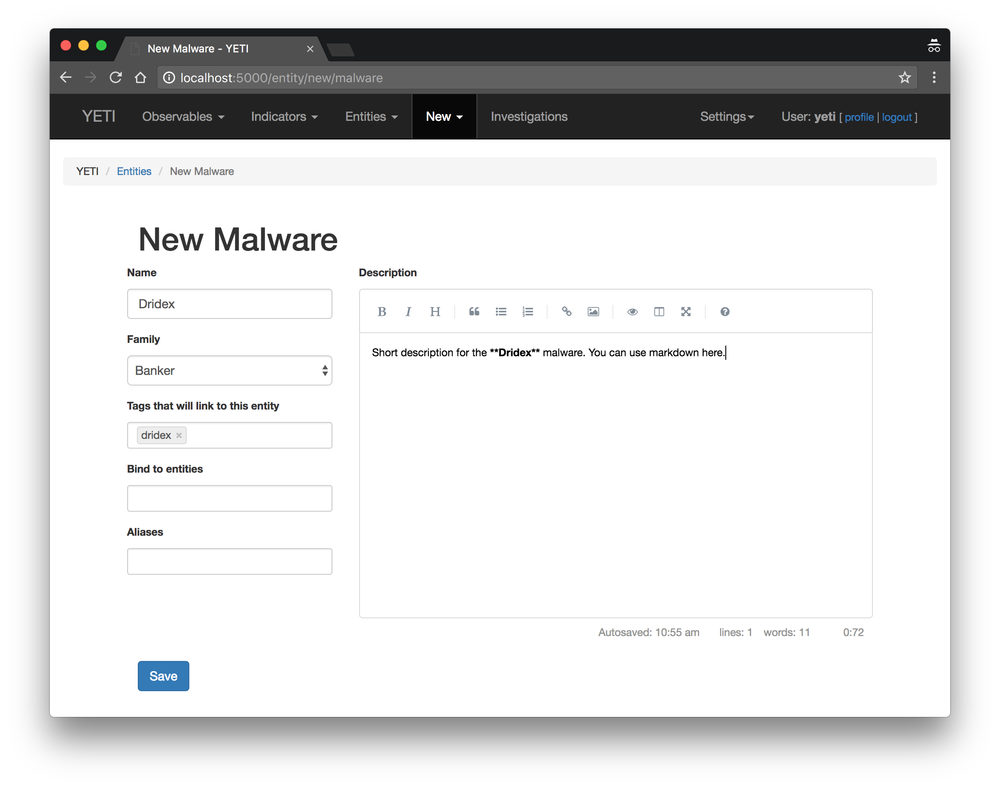
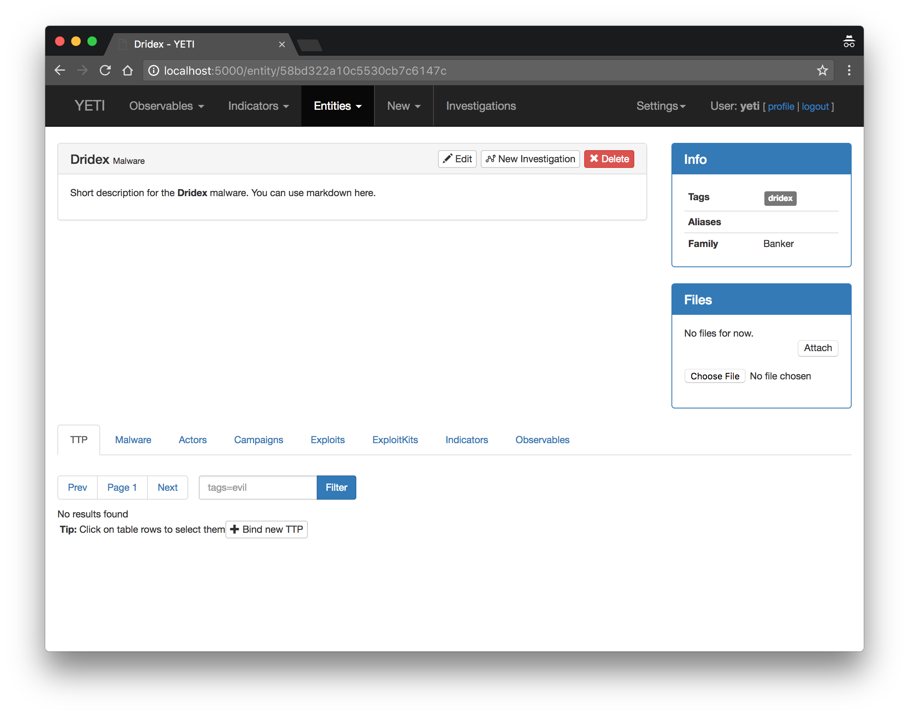
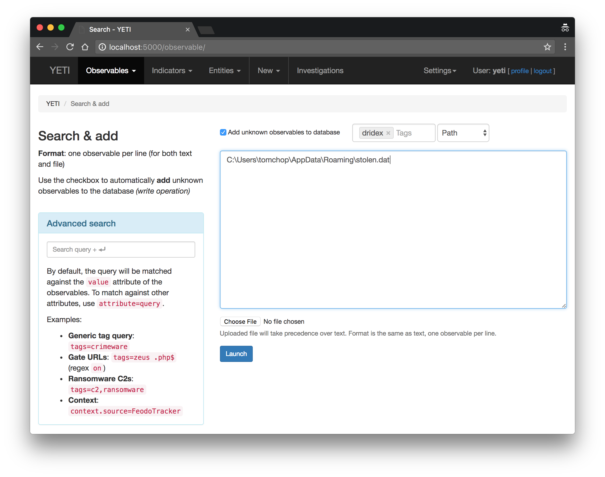
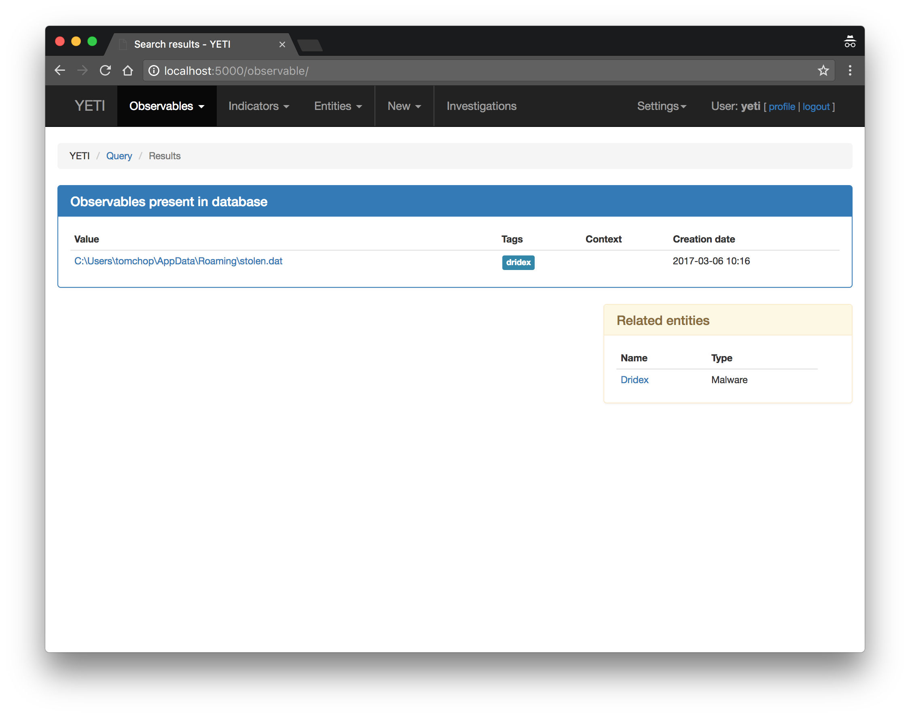
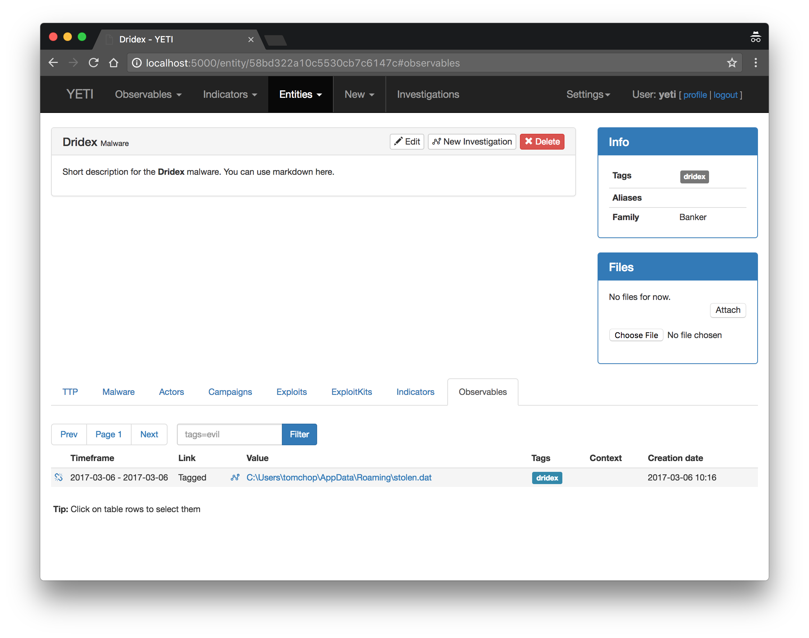
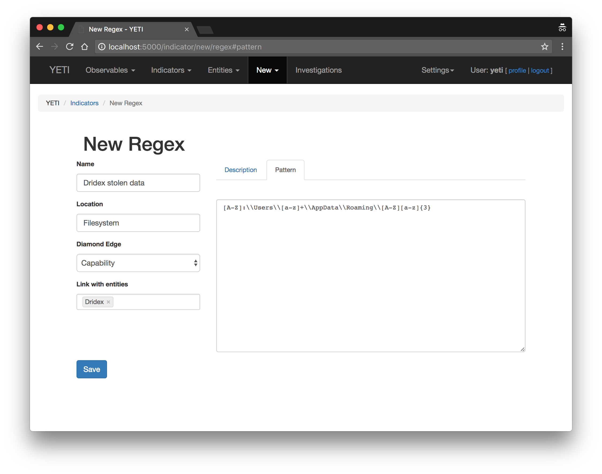
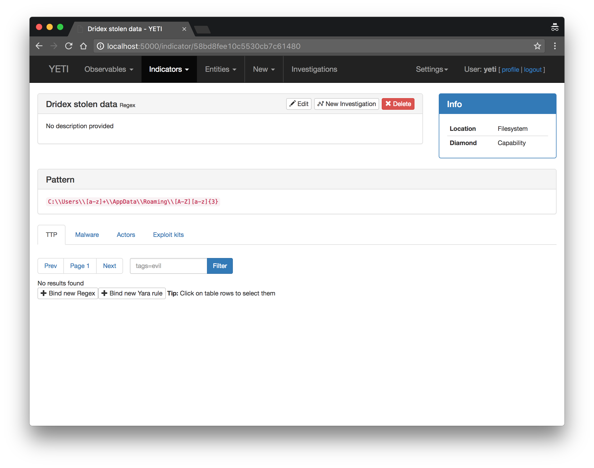
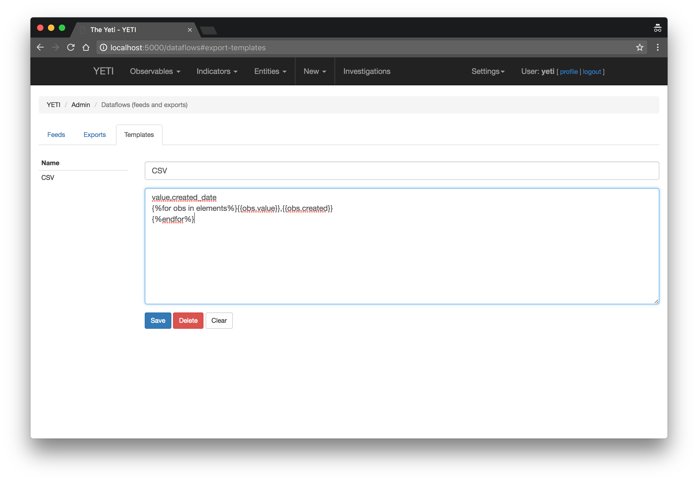
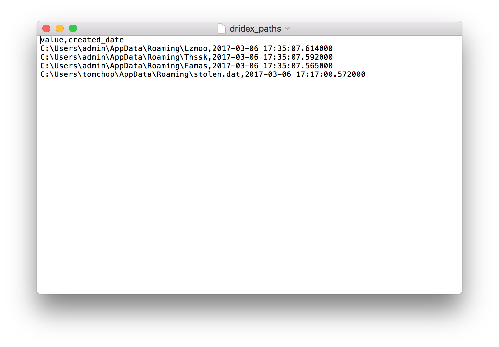

Use-cases
=========

So Yeti sounds cool, but how to I actually use it? Glad you asked. even though
great efforts have been made to "build the manual into the UI", it's natural
that some questions arise.

You will need to have a running install of Yeti for this to make any sense.
Please refer to the :ref:`installation` section of the documentation.

*What is it all about?*

Yeti is about organizing observables, indicators of compromise, TTPs, and
knowledge on threat actors in a single, unified repository. Ideally, this
repository should be queryable in an automated way by other tools (spoiler:
it is!)

Documenting malware intelligence
--------------------------------

Your sandbox just spat out its analysis of the latest Dridex sample and you
figured out that it's using a subdirectory in the user's ``Roaming`` directory
to store the data it steals. You'd like to document this so that another analyst
can quickly know that this is typical Dridex behavior.

Creating a Malware Entity
^^^^^^^^^^^^^^^^^^^^^^^^^

You start by adding a new **Entity** of type **Malware** called Dridex. Navigate
to **New > Malware**, and populate the fields.

Most fields are self-explanatory. As for the others:

* **Tags that link to this entity** - Observables tagged with the Tags specified
  here will be linked to this Entity. See note below for more information.
* **Bind to entities** - Allows you to bind this entity to another one. Malware to TTPs, actors to malware, etc.
* **Aliases** - Other known names for this entity. This field will be indexed in search too.

.. note:: Tags are a way to quickly assess an Observable's context. Yeti also uses tags
          to link observables to **Entities** (TTPs, Actors, Exploit Kits, etc.)
          When you tag an observable, Yeti will
          look for any Entities that have declared these tags and link the observable to them. You
          can also tag observables even if no Entity has declared it; it will just not be linked to anything.
          This is may be useful for tags like ``sinkhole``, ``whitelist``, ``internal``.

Clicking on **Save** will take you to the following page:

This will be your go-to page for all information on Dridex. You can get back to it
by navigating to "Entities > Malware".

.. note:: The **Files** control box allows you to upload files (external reports, samples, etc.) and attach them to this Entity.
  *(No further processing is done on these files, for the moment)*.

Any other linked entities will appear in their corresponding tab under the **Description** section.

Adding Observables
^^^^^^^^^^^^^^^^^^

**Time to add our observable!** Head to **Observables > Search & Add**. This page
allows you to add or try to match one or several Observables. The "write" behavior
is toggled by the **Add unknown observables to database** checkbox. When adding
Observables, you can specify one or more Tags for your observable as well as the observable type.
Guessing should be fine for most observable types (URLs, IP addresses, hostnames)
but make sure you specify it if it gets ambiguous (e.g. Bitcoin address vs. Hash).

Let's add the following observable::

  C:\Users\admin\AppData\Roaming\Adada\stolen.dat

Click on **Launch** to launch the Search / Add procedure.

The results page shows the newly added Observable(s) as well as any entities
associated linked to them, if any. In this case, we're "cheating" since tagging
our Observable "Dridex" associated the observable to the malware. But if another
analyst searches for the same observable, they will leverage Yeti's database and
see the newly created association (you can try this by just searching for your
Observable again, with the "Add to database" checkbox off.).

You can navigate back to the Dridex page by clicking on the link under *Related
Entities*. Notice how the "Observables" tab shows the link
was successful. You can always break the link between Entities and Observables by hovering
on the line and clicking the "Unlink" icon, as can be seen below:

Adding indicators
^^^^^^^^^^^^^^^^^

The following week, you run into a new sample of Dridex seems to have changed. It
now stores its data in a random subdirectory under ``Roaming``. You've observed
the following paths:

* ``C:\Users\admin\AppData\Roaming\Famas``
* ``C:\Users\admin\AppData\Roaming\Thssk``
* ``C:\Users\admin\AppData\Roaming\Lzmoo``

At this point, it seems pretty clear that the subdirectory name consists of 1 uppercase letter
followed by 3 lowercase letters, all chosen randomly.
You add the three observables to the database as seen before, tagging them
``dridex``. But what if an analyst searches for
``C:\Users\admin\AppData\Roaming\Enxa`` or ``C:\Users\admin\AppData\Roaming\Xiwa``?
This is precisely what indicators are for.

Think of indicators as an "enhanced Observable". Indicators come in different flavors,
simple regular expressions or Yara rules (other indicator types will be included in the future).
When submitting Observables in "Search & Add", Yeti will run all your indicators on them
and any matches will be put forward.

Head over to **New > Regular expression** and complete the **Pattern** tab as follows::

  [A-Z]:\\Users\\[a-z]+\\AppData\\Roaming\\[A-Z][a-z]{3}

Make sure you add "Dridex" in the "Link with entities" field.

Short explanation on fields:

* **Location** - This helps the analyst know where they can find this indicator.
  This is free-text and useful values could be *Filesystem*, *HTTP headers*,
  *HTTP URI*, *Registry*, etc.
* **Diamond edge** - Corresponding Diamond Model edge.
* **Link with entities** - Link this Indicator to other entities. In this case
  we want to link it to Dridex.
* **Pattern** - Complete this with your regular expression or Yara rule.

Note how the **Malware** tab in the indicator page on the screenshot above now shows a link to the Dridex malware. Opening the
Dridex entity and selecting the **Indicators** tab also reflects this
relationship:

.. image:: _static/dridex_indicators.png

Good! Now any analysts who wonder if a weirdly-named directory under ``Roaming`` is
actually malware, they can look it up in the **Observables > Search & Add** page with or without
checking the "Add unknown" checkbox.

.. image:: _static/indicator_match.png

In our example, we haven't checked the "Add" checkbox, so we can add the observable
and tag it directly from this page.

.. note:: The "suggested tags" are generated by the Entity name and any associated tags the entity has.
   In this case, Dridex is tagged with "dridex" and "banker".

Automation
^^^^^^^^^^

All this information can be queried from other software (think incident
management platforms, forensic frameworks...) using Yeti's API. Let's search for
all observables with a value matching the regular expression ``r"Roaming"``::

  $ http -vv --json POST localhost:5000/api/observablesearch/ filter:='{"value": "Roaming"}' params:='{"regex": "true"}'
  POST /api/observablesearch/ HTTP/1.1
  Accept: application/json, */*
  Accept-Encoding: gzip, deflate
  Connection: keep-alive
  Content-Length: 61
  Content-Type: application/json
  Host: localhost:5000
  User-Agent: HTTPie/0.9.8

  {
      "filter": {
          "value": "Roaming"
      },
      "params": {
          "regex": "true"
      }
  }

  HTTP/1.0 200 OK
  Content-Length: 2033
  Content-Type: application/json
  Date: Mon, 06 Mar 2017 17:38:50 GMT
  Server: Werkzeug/0.11.15 Python/2.7.13

  [
      {
          "context": [],
          "created": "2017-03-06T17:35:07.614000",
          "human_url": "http://localhost:5000/observable/58bd9dcb10c553738521480e",
          "id": "58bd9dcb10c553738521480e",
          "last_analyses": {},
          "sources": [],
          "tags": [
              {
                  "first_seen": "2017-03-06T17:35:07.627000",
                  "fresh": true,
                  "last_seen": "2017-03-06T17:35:07.627000",
                  "name": "dridex"
              }
          ],
          "type": "Path",
          "url": "http://localhost:5000/api/observable/58bd9dcb10c553738521480e",
          "value": "C:\\Users\\admin\\AppData\\Roaming\\Lzmoo"
      },
      {
          "context": [],
          "created": "2017-03-06T17:35:07.592000",
          "human_url": "http://localhost:5000/observable/58bd9dcb10c553738521480b",
          "id": "58bd9dcb10c553738521480b",
          "last_analyses": {},
          "sources": [],
          "tags": [
              {
                  "first_seen": "2017-03-06T17:35:07.606000",
                  "fresh": true,
                  "last_seen": "2017-03-06T17:35:07.606000",
                  "name": "dridex"
              }
          ],
          "type": "Path",
          "url": "http://localhost:5000/api/observable/58bd9dcb10c553738521480b",
          "value": "C:\\Users\\admin\\AppData\\Roaming\\Thssk"
      },
      {
          "context": [],
          "created": "2017-03-06T17:35:07.565000",
          "human_url": "http://localhost:5000/observable/58bd9dcb10c5537385214808",
          "id": "58bd9dcb10c5537385214808",
          "last_analyses": {},
          "sources": [],
          "tags": [
              {
                  "first_seen": "2017-03-06T17:35:07.585000",
                  "fresh": true,
                  "last_seen": "2017-03-06T17:35:07.585000",
                  "name": "dridex"
              },
              {
                  "first_seen": "2017-03-06T17:35:21.268000",
                  "fresh": true,
                  "last_seen": "2017-03-06T17:35:21.268000",
                  "name": "banker"
              }
          ],
          "type": "Path",
          "url": "http://localhost:5000/api/observable/58bd9dcb10c5537385214808",
          "value": "C:\\Users\\admin\\AppData\\Roaming\\Famas"
      },
      {
          "context": [],
          "created": "2017-03-06T17:17:00.572000",
          "human_url": "http://localhost:5000/observable/58bd998c10c55366bedca50b",
          "id": "58bd998c10c55366bedca50b",
          "last_analyses": {},
          "sources": [],
          "tags": [
              {
                  "first_seen": "2017-03-06T17:17:00.595000",
                  "fresh": true,
                  "last_seen": "2017-03-06T17:17:00.595000",
                  "name": "dridex"
              }
          ],
          "type": "Path",
          "url": "http://localhost:5000/api/observable/58bd998c10c55366bedca50b",
          "value": "C:\\Users\\tomchop\\AppData\\Roaming\\stolen.dat"
      }
  ]

We can also match observables against indicators, just like in the "Search & Add"
page. This is typically what you'd want to implement in your sandbox's code, so
that it can **automatically query Yeti with any observables it finds** and return any interesting
results based on your intelligence!

Try matching an new, unknown observable ``C:\Users\admin\AppData\Roaming\Ijhsz``::

  $ http -jvv POST http://localhost:5000/api/analysis/match observables:='["C:\\\\Users\\\\admin\\\\AppData\\\\Roaming\\\\Ijhsz"]'
  POST /api/analysis/match HTTP/1.1
  Accept: application/json, */*
  Accept-Encoding: gzip, deflate
  Connection: keep-alive
  Content-Length: 62
  Content-Type: application/json
  Host: localhost:5000
  User-Agent: HTTPie/0.9.9

  {
    "observables": [
        "C:\\Users\\admin\\AppData\\Roaming\\Ijhsz"
    ]
  }

  HTTP/1.0 200 OK
  Content-Length: 1449
  Content-Type: application/json
  Date: Sun, 26 Nov 2017 18:06:37 GMT
  Server: Werkzeug/0.11.15 Python/2.7.13

  {
    "entities": [
        {
            "description": "Dridex is a common **banking trojan**.",
            "family": "banker",
            "human_url": "http://localhost:5000/entity/5a1add5c10c5537472a8cbd1",
            "id": "5a1add5c10c5537472a8cbd1",
            "matches": {
                "indicators": [
                    {
                        "description": "",
                        "diamond": "target",
                        "human_url": "http://localhost:5000/indicator/5a1ae41610c5537472a8cbd5",
                        "id": "5a1ae41610c5537472a8cbd5",
                        "location": "Filesystem",
                        "matched_observable": "C:\\Users\\admin\\AppData\\Roaming\\Ijhsz",
                        "name": "Dridex stolen data",
                        "pattern": "[A-Z]:\\\\Users\\\\[a-z]+\\\\AppData\\\\Roaming\\\\[A-Z][a-z]{3}",
                        "type": "Regex",
                        "url": "http://localhost:5000/api/indicator/5a1ae41610c5537472a8cbd5"
                    }
                ]
            },
            "name": "Dridex",
            "tags": [
                "dridex"
            ],
            "type": "Malware",
            "url": "http://localhost:5000/api/entity/5a1add5c10c5537472a8cbd1"
        }
    ],
    "known": [],
    "matches": [
        {
            "description": "",
            "diamond": "target",
            "human_url": "http://localhost:5000/indicator/5a1ae41610c5537472a8cbd5",
            "id": "5a1ae41610c5537472a8cbd5",
            "location": "Filesystem",
            "name": "Dridex stolen data",
            "observable": "C:\\Users\\admin\\AppData\\Roaming\\Ijhsz",
            "pattern": "[A-Z]:\\\\Users\\\\[a-z]+\\\\AppData\\\\Roaming\\\\[A-Z][a-z]{3}",
            "related": [
                {
                    "entity": "Malware",
                    "link_description": "Indicates",
                    "name": "Dridex"
                }
            ],
            "suggested_tags": [
                "dridex",
                "banker"
            ],
            "type": "Regex",
            "url": "http://localhost:5000/api/indicator/5a1ae41610c5537472a8cbd5"
        }
    ],
    "neighbors": [],
    "unknown": [
        "C:\\Users\\admin\\AppData\\Roaming\\Ijhsz"
    ]
  }

Ingesting and enriching a third-party report
--------------------------------------------

Creating a blocklist
--------------------

An export is a recurring task that will render a (usually large) selection of
tagged Observables according to a specific Template. In this scenario we're
going to create a list of all Path observables involving the Dridex malware.

Creating an export template
^^^^^^^^^^^^^^^^^^^^^^^^^^^

First thing you want to do when creating an Export is to crate a matching
Template. Templates are a way for Exports to know how to render the data they're
cycling through. The templating engine is Jinja2, the same one Flask uses for
rendering webpages; it is therefore extremely flexible.

.. note:: Tempates can be re-used across exports. For instance, you can have one
          CSV template rendering `value,tags`, and you may want to create
          separate CSV exports for URLs, Hostnames, and IPs: they can all re-use
          the same CSV template. In this case, since it's your first export,
          you'll need to create the template first.

Head to **Settings > Dataflows** and click on the **Templates** tab. The form
is pretty straightforward, a **Name** and a **Body**. The body must be valid
Jinja2 (a very succint example is provided in the placeholder). The template is
fed a generator of Observables called ``elements``.

For instance, if we want to create a `value,created_date` CSV, we need to write
something along the lines of::

  value,tags
  ,{{obs.value}}{{obs.created}}
  

.. warning:: Since this will be rendered as text and not as HTML, whitespace is
             taken into account (this is why the loop does not span multiple
             lines)

Now back to the export tab. Click on the **New** button. Noteworthy fields in
this form include:

* **Ignore tags** - These are tags that should be ignored. They will disappear
  from the exported data. Also, if an Observable's *only* tag is an ignored tag,
  it won't be exported. E.g.: You have a feed that tags Alexa's top 1M domains
  with Alexa. You may want to export them if they are tagged with `malware`
  or `C2`, but not if they are *only* tagged `alexa`.

* **Include tags** - By default Exports will select all tagged Observables. Here
  you can refine this selection by specifying which tags the Observables *must*
  have to be exported. E.g.: You want to create a separate, high-confidence
  blocklist for ransomware URLs, you could include `ransomware` and `high` here.

* **Exclude tags** - Same rationale, sometimes you may want some Observables
  *never* to be exported, even if they are tagged with other stuff. E.g. Google
  is often tagged `malware` since it happens that malicious domains are
  sometimes "parked" on Google IPs. If `google.com` is tagged `whitelist`, you
  might want to include `whitelist` here.

Once this is set, click "Save" and your export is ready to go!

.. image:: _static/dridex_export.png

Provided the Celery Scheduler is launched, you should be generating your feeds
soon enough. You can toggle or manually generate them using the icons on the
corresponding line. The link icon contains the external link where the exported
data will be available from. You can try downloading it:

